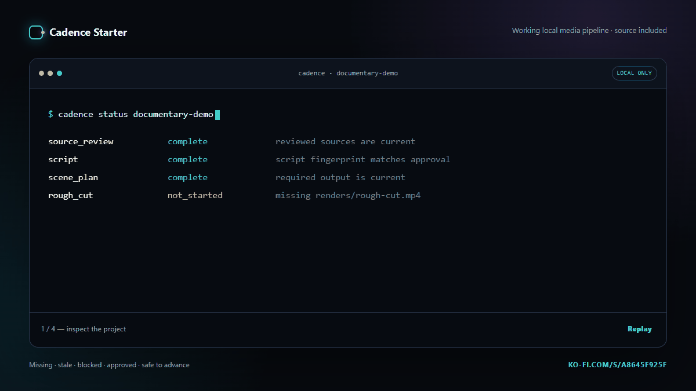

# Cadence Starter public preview

This repository contains the public landing page and a truthful product demonstration for [Cadence Starter](https://ko-fi.com/s/a8645f925f).

It does **not** contain the paid Cadence Starter source, customer ZIP, private media, credentials, channel data, prompts, production integrations, or the seller's private pipeline.

## What Cadence Starter is

Cadence Starter is a local workflow engine for documentary, explainer, and faceless-media projects. It tracks declared files and dependencies, identifies stale or blocked work, fingerprints human approvals, and previews configured commands before explicit execution.

The complete paid product includes the Python source, editable registries, schemas, templates, fictional example, handbook, commercial-use licence, and 18 automated tests.

## Public demo

Open `index.html` locally or visit the GitHub Pages site. The terminal sequence is an illustrative walkthrough using the real Cadence state names and command shapes; it contains no customer or private project data.

## Product

- [View Cadence Starter](https://ko-fi.com/s/a8645f925f)
- Price: $49 USD or more
- Requirements: Python 3.10+, Windows/macOS/Linux, basic terminal and text-file comfort

## Repository licence

The landing-page code in this public repository is MIT licensed. Product artwork, product copy, the Cadence Starter name, and the paid Cadence Starter source are not granted under that licence; see `NOTICE.md`.
